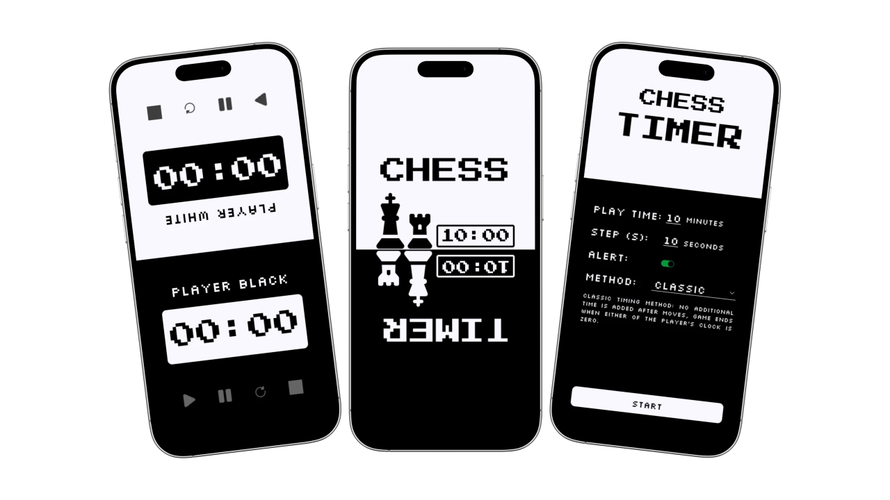
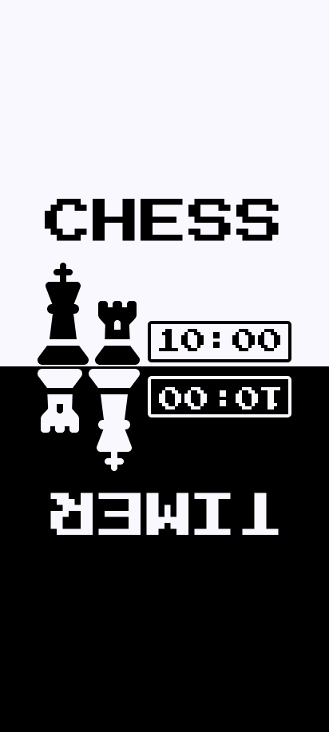
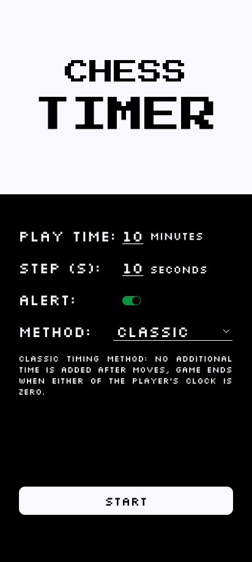
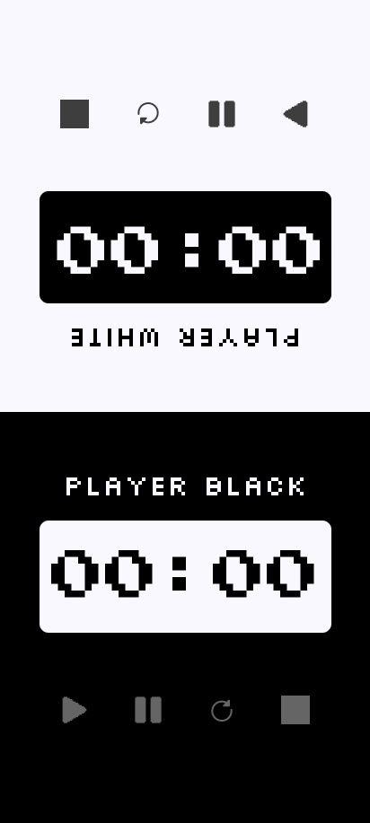

# 📱 Portfolio App



## 📖 Overview
A simple and intuitive Chess Clock application for Android, built using **Kotlin** and **XML**. The app provides a dual-timer interface for two-player chess games, with support for multiple time-control systems and useful game controls.

---

## 🚀 Key Features

- ⏱️ Dual Chess Timer — Separate countdown timers for both players.
- ♟️ 3 Time Control Modes
    - Classic — Players have a fixed amount of time with no increment.
    - Fischer — Adds a fixed increment to a player's clock after each move.
    - Bronstein — Adds a delay before the player's clock starts counting down.
- 🔔 Alert Tones — Audio notifications to indicate important timer events.
- 🎮 Game Controls
    - Pause
    - Resume
    - Restart
    - Stop
- 📱 Built specifically for Android using Kotlin and XML.

---

## 🧑‍💻 Tech Stack

- Kotlin
- XML
- Android SDK
- MediaPlayer
- CountDownTimer

---

## 📁 Project Structure
```
Portfolio-App/
│
├── app/
│   └── src/
│       └── main/
│           ├── java/
│           │   └── com/example/chesstimer/
│           │       ├── ActivityHome.kt
│           │       ├── ActivityTimer.kt
│           │       ├── LauncherScreen.kt
│           │       └── TimerMethods.kt
│           │
│           └── res/
│               ├── drawable/
│               ├── font/
│               ├── layout/
│               │   ├── activity_home.xml
│               │   ├── activity_timer.xml
│               │   └── launcher_screen.xml
│               ├── anim/
│               └── values/
│
├── ProjectScreenShots/
├── README.md
└── build.gradle
```

---

## 📷 Screenshots

| Splash Screen Activity                    | Home Activity                    | Timer Activity                    |
|-------------------------------------------|----------------------------------|-----------------------------------|
|  |  |  |

---

## 📖 What I Learned

While building this project, I gained experience with:

- Writing clean and maintainable code
- Designing Android user interfaces using XML
- Working with timers and countdown logic
- Implementing different chess time-control systems
- Using MediaPlayer for audio and alert tones
- Managing application state and game controls
- Android application development with Kotlin

---

<div align="center">


</div>

---